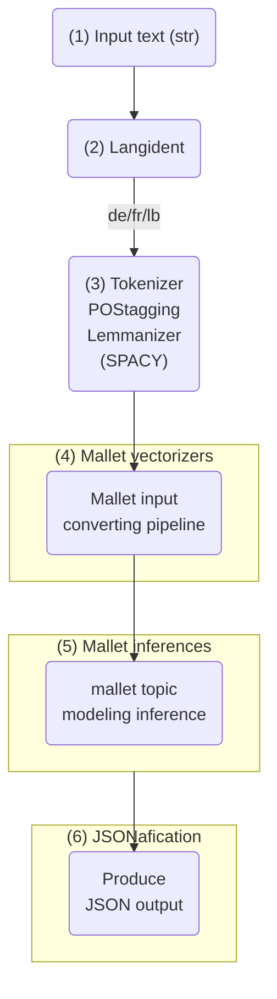

## Exaplanation of LDATopics Pipeline

### Diagram

### 1. Input Text (str)
The pipeline starts with a text input in string format. This could be any textual data that needs to be analyzed.

### 2. Langident (Language Identification)
The system uses a language identification tool to detect the language of the input text. Based on the output, the text is classified as German (`de`), French (`fr`), or Luxembourgish (`lb`).

### 3. Tokenizer, POS Tagging, and Lemmatization (Using SpaCy)
Once the language is identified, the text undergoes several preprocessing steps:
- **Tokenization**: The text is split into individual words.
- **Part-of-Speech (POS) Tagging**: Words are assigned grammatical categories (e.g., noun, verb, adjective).
- **Lemmatization**: Words are reduced to their base form (e.g., *running* → *run*).

Output is a list of lemmatized tokens: `['ein', 'klein', 'Hund', 'namens', 'Max', 'leben', 'in', 'ein', 'ruhig', 'Dorf', ...]`

### 4. Mallet Vectorizers
The processed text is converted into a format suitable for MALLET topic modeling. This step likely includes **text vectorization**, where words are transformed into numerical representations.

### 5. Mallet Inferences
MALLET applies **topic modeling**, typically using **Latent Dirichlet Allocation (LDA)** or another probabilistic model. The system infers **topics** from the text.

### 6. JSONification
The topic modeling results are formatted into **JSON output**. This output is likely structured with **topic distributions, keywords, and document-topic probabilities**, making it easier to use for downstream applications.

## LDATopics Example
Make sure you have installed the package as demostrated in the main README. 
